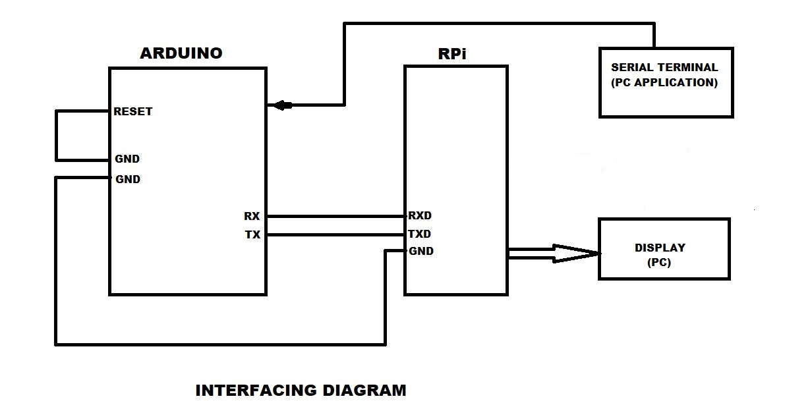

# Serial-communication-using-Raspberry-Pi

### OBJECTIVE

To demonstrate the serial communication without using USB to TTL driver

### INTRODUCTION

This project is to indicate communicating with RPi and PC with help of arduino.Here we make use of arduino
instead of a USB to TTL driver.This experiment helps us to understand how to serially communicate with RPi.
This is conducted with windows as the operating system.

### PROCEDURE
I shall explain this experiments through the steps as follows. 
Step 1:Using sudo raspi-config command ,enable the UART.(Make sure you have PySerial package installed). 
Step 2:Follow the commands to be prompted to configure RPi in the sheet I have uploaded. 
Step 3:Install any serial terminal PC application (in my case HW Hercules). 
Step 4:Check for the COM port in Device Manager. 
Step 5:Run the python code present in my link. 
These steps would work the required. 

### INTERFACING DIAGRAM

